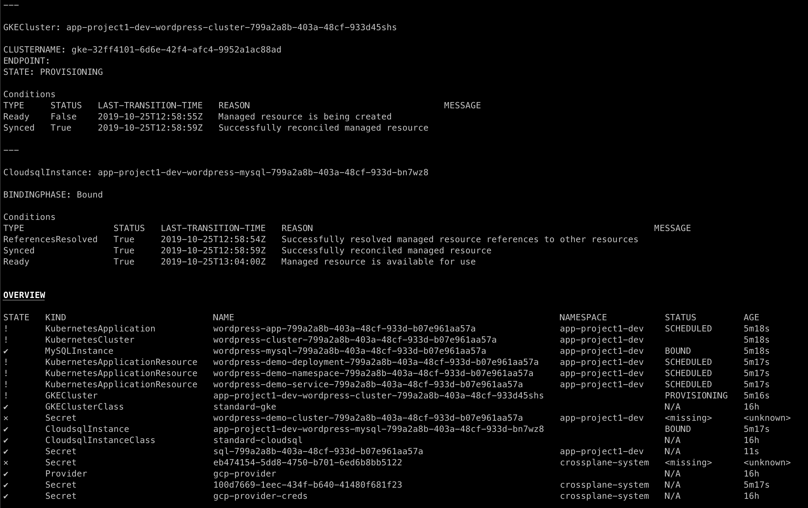
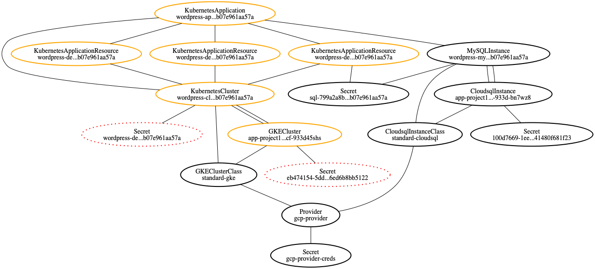

# Trace Command

## Overview

Applications deployed with Crossplane usually contains several Crossplane Custom Resources (CRs). Additionally 
Crossplane applies the Kubernetes pattern for Persistent Volume (PV) claims and classes which results in multiple 
resources which are closely related. While this enables separation of concern between app teams and cluster administrators, 
it also makes debugging and troubleshooting uneasy. A problem in the bottom of the resource hierarchy affects upper 
layers and finding actual root cause requires couple of consecutive commands both to see the status and to get the 
reference of the next resource. 

For example, when a `KubernetesApplicationResource` reports a failure in its status indicating that there is something 
wrong with accessing Kubernetes cluster, user needs to first find the corresponding `Resource Claim`, check its status
and may need to continue with the `Managed Resource`, `Resource Class` and `Provider` resources.

Trace command aims to ease debugging and troubleshooting process by providing a holistic view for the resource being 
traced. 

## Usage

The trace tool is part of the crossplane kubectl plugin and can be used as follows:

```bash
$ kubectl crossplane trace --help
Usage: kubectl crossplane trace TYPE[.GROUP] NAME [-n| --namespace NAMESPACE] [-h|--help]

-h, --help                  Shows this help message
    --kubeconfig string     Absolute path to the kubeconfig file
-n, --namespace string      Namespace (default "default")
-o, --outputFormat string   Output format. One of: dot
```

Examples:

```
### Text output
# Trace a KubernetesApplication
$ kubectl crossplane trace KubernetesApplication wordpress-app-83f04457-0b1b-4532-9691-f55cf6c0da6e -n app-project1-dev

# Trace a MySQLInstance
$ kubectl crossplane trace MySQLInstance wordpress-mysql-83f04457-0b1b-4532-9691-f55cf6c0da6e -n app-project1-dev

### Graph output, which can be visualized with graphviz as follows.
$ kubectl crossplane trace KubernetesApplication wordpress-app-83f04457-0b1b-4532-9691-f55cf6c0da6e -n app-project1-dev -o dot | dot -Tpng > /tmp/output.png
```

### State of a resource

Each object in the trace output categorized in one of the following states which is represented in text (state column of
overview) and graph output (as node attributes) accordingly.

| State | Text Representation | Graph Representation | 
| :--------: | :---: | :---: |
| Ready    | ✔ | Solid - Black |
| NotReady | ! | Solid - Orange |
| Missing  | ✕ | Dotted - Red |

### Sample outputs

#### Text output 



#### Graph output 




## How it works

The trace tool categorizes Crossplane resources based on a mapping between resource group/kinds and one of the following 
Crossplane resource types. Then it finds the related resources with the help of the references available in the resource
declarations as shown below. 

- [Kubernetes Application](https://github.com/crossplaneio/crossplane/blob/master/docs/concepts.md#kubernetes-application)
    - `status.clusterRef` -> KubernetesCluster
    - listing/filtering all `KubernetesApplicationResources` and `ResourceClaims` in the same namespace with labels 
  at `spec.resourceSelector.matchLabels`
  
- Kubernetes Application Resource 
    - `status.clusterRef` -> KubernetesCluster
    - `spec.secrets` -> [Connection secrets](https://github.com/crossplaneio/crossplane/blob/master/docs/concepts.md#connection-secrets)
   
- [Resource Claim](https://github.com/crossplaneio/crossplane/blob/master/docs/concepts.md#kubernetes-application)
    - `spec.resourceRef` -> Managed Resource
    - `spec.classRef` -> Resource Class
    - `spec.writeConnectionSecretToRef` -> [Connection secrets](https://github.com/crossplaneio/crossplane/blob/master/docs/concepts.md#connection-secrets)

- [Managed Resource](https://github.com/crossplaneio/crossplane/blob/master/docs/concepts.md#managed-resource)
    - `spec.claimRef` -> Resource Claim
    - `spec.classRef` -> Resource Class
    - `spec.writeConnectionSecretToRef` -> [Connection secrets](https://github.com/crossplaneio/crossplane/blob/master/docs/concepts.md#connection-secrets)
  
- [Resource Class](https://github.com/crossplaneio/crossplane/blob/master/docs/concepts.md#non-portable-resource-class) 
    - `specTemplate.providerRef` -> Provider

- [Provider](https://github.com/crossplaneio/crossplane/blob/master/docs/concepts.md#provider)
    - `spec.credentialsSecretRef` -> Credentials Secret
    
Knowing related objects for a given one, the trace tool builds a graph representing the relations. The data of the 
graph is outputted either in text format or as [graph definition dot format](https://www.graphviz.org/doc/info/lang.html). 
Text output contains both an overview of all related types indicating [their state](#state-of-a-resource))

## Future Work

- Improve overview of text output to represent the hierarchy

- Support tracing resources referenced with 
[cross resource referencing](https://github.com/crossplaneio/crossplane/blob/master/design/one-pager-cross-resource-referencing.md).

- Support dynamically defining new resources/relations (via a config file) without rebuilding the binary which can 
position the tool as a general purpose tracing tool for tracing any Kubernetes Resource. This could make supporting 
[cross resource referencing](https://github.com/crossplaneio/crossplane/blob/master/design/one-pager-cross-resource-referencing.md)
much easier.
 
- Based on the [pattern established for parent child relationships](https://github.com/crossplaneio/crossplane/issues/752), 
support tracing starting with stack instances.
